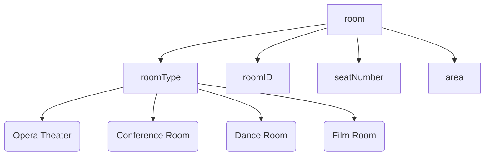
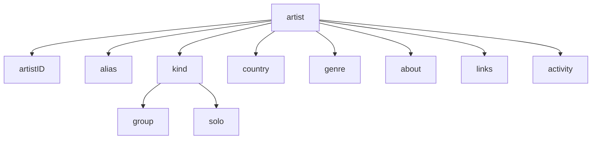
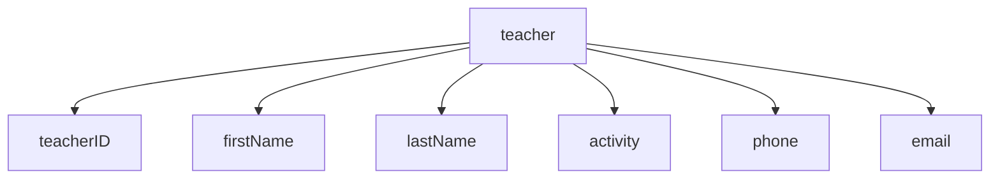
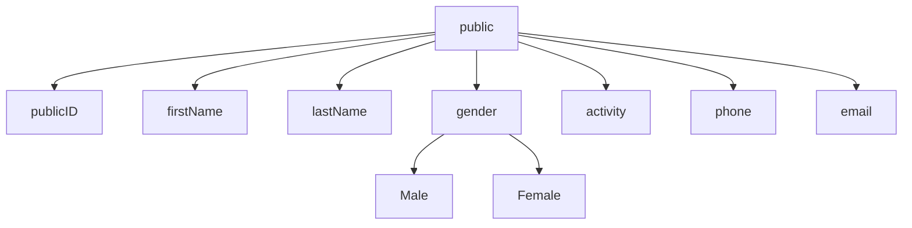
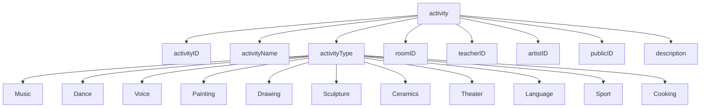
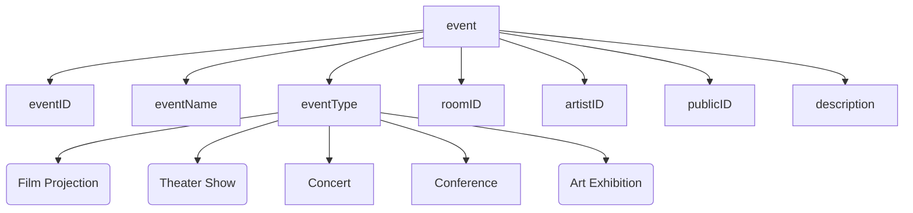
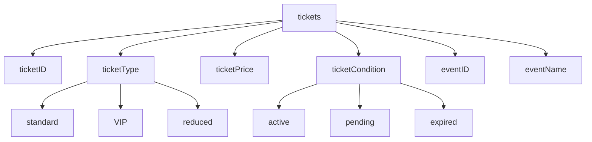
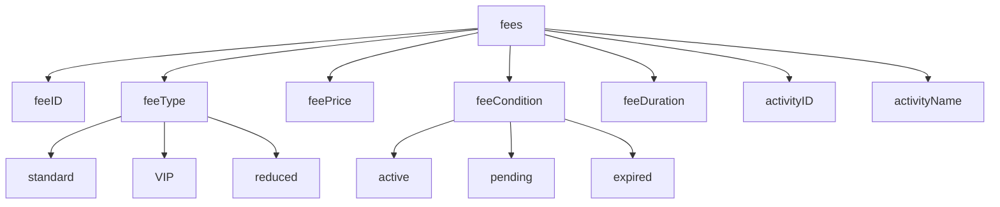
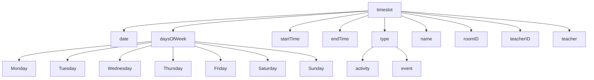

# Data Pipeline Report 

## objective

Modeling of an XML database for the information system of a cultural center. 

## work load distribution

| name    | task                                                         |
| ------- | ------------------------------------------------------------ |
| Tetiana | Implemented XML file and its schema for activities and events, as well as realized visualisation (XSLT) of scenarios 4 and 7. |
| Vincent | Implemented XML file and its schema for people, which includes artists, teachers, public (choice was made to name public attending activities), also performed visualisation (XSLT) of scenario 6. |
| Yilun   | Implemented the XML file and its schema for rooms and scheduling of activities, and also realized the visualisation (XSLT) of scenario 1, 2 and 3. |
| Mori    | Implemented the XML file and its schema of ticket and fee database, performed the visualisation (XSLT) of scenario 5; created main schema & database which joined the work of other team members. |

## working environment

Webstorm and vscode has been used as IDE for the main development environment. Other online sources for reference includes: w3 school, Github, liquid tech Online XML Validator, chatGPT, etc.

## modeling design

In the xsd file, a cultrual center is defined in the following 4 sections: rooms, people, activity&event and ticket&fee. And each has their own sub-elements to acquire further restraints. As stated below:

### schema

#### room

In the schema of room, a "room type" regulates the main type of rooms as follow: "Opera Theater", "Conference Room", "Dance Room", and "Film Room". As well as a "roomID", "seatNumber", and "area".  

#### artist, teacher, public

Each kind of people will be involved in different ways.

- artists are related to events. Some information are really specific to artists : alias (instead of name), genre, group or solo.
- teachers are given main information to know who they are (name) and how to contact them (phone, email). the element activity indicates which activity they are teaching.
- public are the public attending the activities (they need to be named since they will pay fees to attend activities, and for insurance needs also).

#### activity, event

The activity and event schema is divided into 2 parts regarding activities and events information accordingly: 

- a wide range of activity types, such as: "Music", "Dance", "Voice", "Painting", "Drawing", "Sculpture", "Ceramics", "Photography", "Theater", "Language", "Sport" and "Cooking"; information about the activities name and description as well as the identidication of people who participated and/or conducted these activities;
- similar to the activity, we included 6 types of the event types like these: "Film Projection", "Theater Show", "Concert", "Conference", "Workshop" and "Art Exhibition"; additionally there is information about the name, description of the events and the people who participated or conducted them;

#### ticket, fee

In this section, main elements should be "ticket" and "fee", in accordance with "event" and "activity". In this simplified model, tickets are only applied in events whereas fee is adapted for activity usage. In addition, 2 enumerations have been defined since the ticket/fee type and condition is designed as standard/VIP/reduced as well as active/pending/expired.

### problem-solving

The main obstacle in the project will be "scheduling", which is the event/activity timeslot managment for the center to further organize its daily schedules. Other than the "main.xsd", a schema of scheduling is defined with "timeslot" and its sub-elements: "date", "daysOfWeek", "startTime", "endTime", "type"(activity/event), "name", "teacherID", and "teacher". Each timeslot retrieves informations from an activity/event with corresponding "room", "teacher" info, which is rigidly defined in the "main.xsd" file. And by having the timeslot schema and its counterpart xml, a visualization of calendar-like result could be seen after xslt transformation.

## Scenarios involving XSLT

Those 5 first scenarios are dedicated to Stylesheet visualization :

##### scenario 1:

Schedule of all activities within a week in the cultural center

##### scenario 2:

Schedule of a teacher

##### scenario 3:

Scheduling of a particular room

##### scenario 4:

Calculation of ticket sold of each event.

##### scenario 5: 

Calculate gender ratio of public

_______________________________________

##### Scenario 6:

The 6th scenario has to output an xml format:

Simple scenario listing all of the teachers, giving their first name, last name, activity, phone number and e-mail address. The output will be scenario6.xml.

______________________________________

##### Scenario 7:

The 7th scenario asks for a json format output:

This scenario is giving an extract of the datas, including all information related to activities.
You should ask a transformation to a file scenario7.json.

## reference

https://www.xfront.com/ZeroOneOrManyNamespaces.html

https://www.liquid-technologies.com/online-xsd-validator

https://medium.com/@mariusilina5/validating-xml-documents-with-xsd-a6ecc4583ad6

